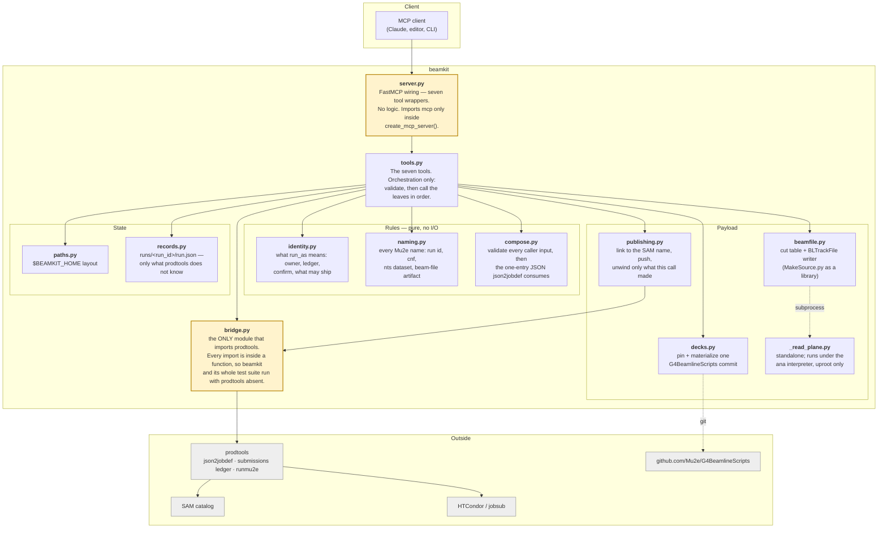
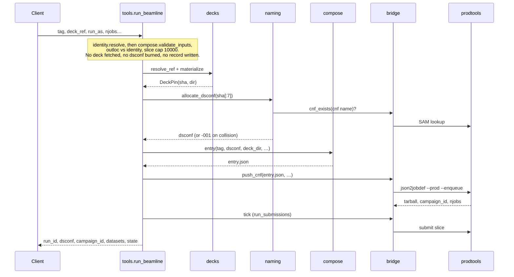
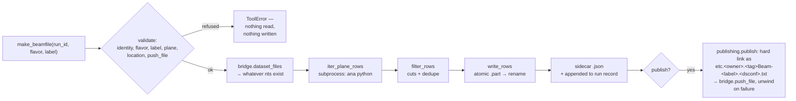

# beamkit architecture

beamkit is a thin client. It owns no queue, no catalog, and no submission
state — prodtools owns all three. What beamkit adds is the layer prodtools
does not have for G4beamline: a reproducible pin of the deck, a name derived
from that pin, an entry JSON composed from it, and a beam-file builder for
the ntuples the run produces.

Everything in `src/beamkit/` is one of four things: a rule (identity, naming,
compose), a seam (bridge, server), a store (paths, records), or a payload
transformer (decks, beamfile, publishing, `_read_plane`). `tools.py` is the
only module that orchestrates; the rest are leaves it calls.

## The layers

Two boundaries carry the design (shaded above). `server.py` is the only thing
that knows about MCP; `bridge.py` is the only thing that knows about
prodtools. Neither contains logic. Every other module can be read, tested, and
reasoned about with both prodtools and `mcp` uninstalled — which is exactly
how the test suite runs.

## What each file is for

| File | Lines | Purpose |
| --- | --- | --- |
| `server.py` | 105 | FastMCP registration for the seven tools. Hand-written wrappers whose signatures are held to `tools.py`'s by an AST test. |
| `tools.py` | 350 | `run_beamline`, `make_recoveries`, `beamline_status`, `list_beamline_runs`, `beamline_outputs`, `make_beamfile`, `get_server_info`. Resolves the identity and validates every input first, then delegates. |
| `bridge.py` | 103 | Lazy, in-function imports of prodtools. Converts every prodtools failure into `BridgeError`. Reads no environment: the dev checkout arrives as an argument. |
| `beamfile.py` | 229 | The cut table (`bm`/`ps` presets or a custom `{keep_pdg, drop_pdg, min_p_mev}`), label and plane validation, the dedupe and structural cuts, and the atomic BLTrackFile writer. |
| `decks.py` | 108 | Resolves a tag/branch/sha against the deck repo and materializes that commit once into a content-addressed cache. |
| `records.py` | 88 | The `RunRecord` dataclass and its atomic save/load. States: `enqueue_failed`, `created`, `submitted`, `needs_attention`. prodtools' ledger is the system of record for submission state. |
| `identity.py` | 77 | What `run_as` means: owner, `mine`, production, confirm requirement, default publish location, and whether a dev prodtools checkout may ship. The only reader of `BEAMKIT_PRODTOOLS_DIR`. |
| `compose.py` | 70 | `validate_inputs`, the one rule for every caller-supplied value, and the single-entry JSON `json2jobdef` consumes. |
| `naming.py` | 66 | Every Mu2e name beamkit produces: run id, cnf, nts dataset, beam-file artifact, and the `-NNN` suffix rule when a cnf name is already taken in SAM. |
| `publishing.py` | 53 | The publish step of `make_beamfile`: knowable-up-front preconditions, hard link to the SAM name, push, and an unwind that discards only what this call created. Tested against a fake push with nothing built. |
| `_read_plane.py` | 40 | Prints one ntuple plane as TSV. Runs under a *different* interpreter (ana 2.8.0, for uproot) and imports nothing from beamkit. |
| `paths.py` | 23 | `$BEAMKIT_HOME` and the three directories under it. |
| `__init__.py` | 2 | Version. |

The test suite fakes every prodtools symbol, so one more test holds the
bridge seam honest: with `BEAMKIT_PRODTOOLS_ROOT` naming a checkout,
`tests/test_bridge_contract.py` imports the real modules in a subprocess and
binds every call `bridge.py` makes to the real signature. It skips otherwise.

## Submitting a run

The order is deliberate. Everything that can be refused is refused before the
deck is materialized; the dsconf is allocated only once the run is going to
happen; and the record is written before the tick, so a submission that dies
mid-flight still leaves something to recover from.

Nothing advances on its own afterwards. `make_recoveries` runs one prodtools
tick — verify, resubmit missing indices, feed the next slice — and that pass is
ledger-wide, so under `run_as="mu2epro"` it also advances every other active
production campaign. While the campaign is `active` the tick is scoped to it.
prodtools marks a campaign `complete` the moment its last slice is submitted,
rows still verifying, and refuses a scoped tick on it; from then on
`make_recoveries` runs the bare tick, whose top-up also feeds every other
active campaign, and the result says which form ran. A tick that returns
prodtools' "needs attention" puts the run in state `needs_attention` until a
clean one returns it to `submitted`.

`run_beamline` is not atomic across its two prodtools calls, and says what a
failure left behind. A push that raised after the cnf reached SAM and the
campaign was created adopts that campaign into the record (state `created`)
so `make_recoveries` submits it; a push that never reached SAM leaves the
dsconf free and the run dir retryable in place.

## Building a beam file

A beam file is always built from whatever the run has produced so far — it
never waits for completeness. `pot = n_files × events_per_job`, and the
indices that are missing are recorded in the sidecar rather than treated as an
error. Every refusal above happens before the first ROOT file is opened,
because on a large run that read is hours long.

## The rules that shaped it

- **One import point.** Only `bridge.py` imports prodtools, and only inside
  functions. This is what lets the suite run anywhere.
- **No fallbacks.** Validate at the boundary and fail loudly naming the cause.
  There is no `else:` branch anywhere that substitutes a default for a failed
  lookup.
- **Two identities.** `run_as="self"` touches only your own scratch, datasets
  and ledger. `run_as="mu2epro"` writes production SAM and submits production
  jobs, and is refused without `confirm=True` — here, and again inside
  prodtools.
- **prodtools owns submission state.** The run record holds the pin, the
  composed parameters and the beam files; it does not duplicate the ledger.
- **One reader per fact.** `run_as` is interpreted in `identity.py`, every
  Mu2e name is spelled in `naming.py`, every caller input is checked in
  `compose.validate_inputs`, and `BEAMKIT_PRODTOOLS_DIR` is read in one
  function. A rule that needs a second home is a rule that will drift.
