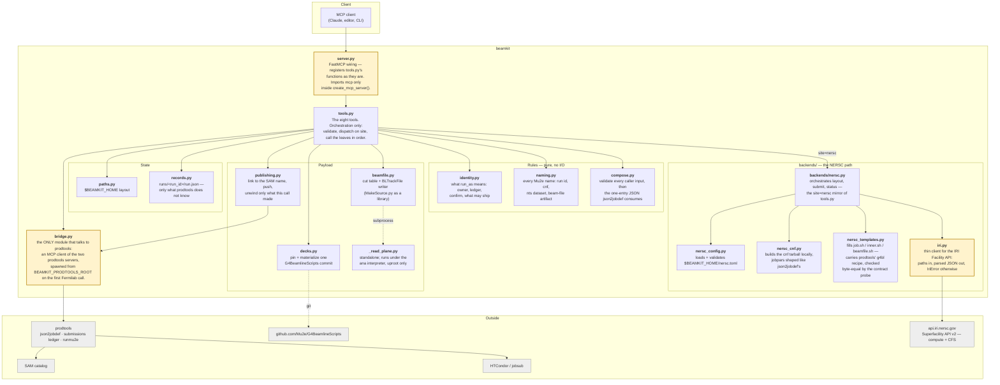
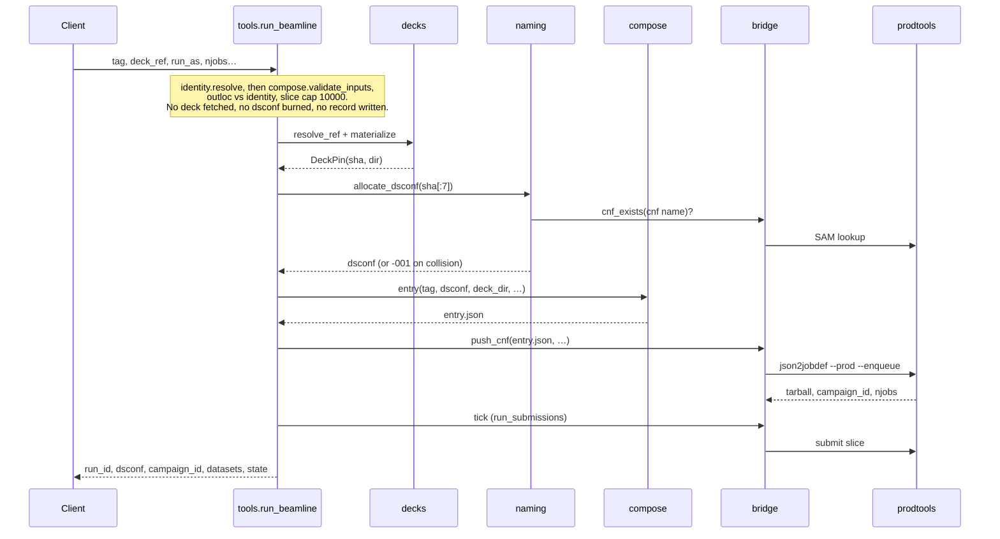
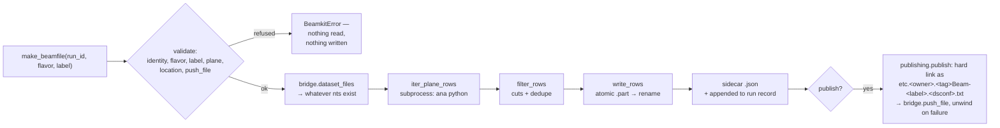

# beamkit architecture

beamkit is a thin client. It owns no queue, no catalog, and no submission
state — prodtools owns all three. What beamkit adds is the layer prodtools
does not have for G4beamline: a reproducible pin of the deck, a name derived
from that pin, an entry JSON composed from it, and a beam-file builder for
the ntuples the run produces.

Everything in `src/beamkit/` is one of four things: a rule (identity, naming,
compose), a seam (bridge, server, iri), a store (paths, records), or a
payload transformer (decks, beamfile, publishing, `_read_plane`,
nersc_cnf, nersc_templates). `tools.py` orchestrates the Fermilab path
directly and dispatches `site="nersc"` calls to `backends/nersc.py`,
which orchestrates that path the same way (layout, submit, status)
against `iri.py` instead of `bridge.py`.

## The layers



Three boundaries carry the design (shaded above). `server.py` is the only
thing that knows about MCP; `bridge.py` is the only thing that knows about
prodtools; `iri.py` is the only thing that knows about the NERSC
Superfacility API. None of the three contains logic. Every other module can
be read, tested, and reasoned about with prodtools, `mcp`, and the network
all absent — which is exactly how the test suite runs.

## What each file is for

| File | Purpose |
| --- | --- |
| `server.py` | FastMCP registration: a name→description table registering all eight tools, each `tools.py` function registered as it is. tools.py annotates every parameter, because the schema is built from them. |
| `tools.py` | `run_beamline`, `make_recoveries`, `submit_run`, `beamline_status`, `list_beamline_runs`, `beamline_outputs`, `make_beamfile`, `get_server_info`. Resolves the identity and validates every input first, dispatches on `site` (`fermilab` through prodtools, `nersc` through `backends/nersc.py`), then delegates. Raises `BeamkitError` for its own refusals and lets each module's subclass through untouched: nothing is caught only to be re-raised. |
| `bridge.py` | MCP client of prodtools' write and read servers (`mcpclient.StdioServer` per child, lazy, kept for the process life). Converts every prodtools failure into `BridgeError`: isError text from the write server, the `{"error": ...}` envelope from the read server. Reads one environment variable, `BEAMKIT_PRODTOOLS_ROOT`; the dev checkout to ship arrives as an argument. |
| `mcpclient.py` | A synchronous handle on one MCP server over stdio: private event loop in a daemon thread, one serve task for the session's life, stderr tail for start failures, respawn after a child dies. Knows nothing about prodtools. |
| `beamfile.py` | The cut table (`bm`/`ps` presets or a custom `{keep_pdg, drop_pdg, min_p_mev}`), label and plane validation, the dedupe and structural cuts, and the atomic BLTrackFile writer. |
| `decks.py` | Resolves a tag/branch/sha against the deck repo and materializes that commit once into a content-addressed cache. |
| `records.py` | The `RunRecord` dataclass and its atomic save/load. States: `enqueue_failed`, `created`, `submitted`, `needs_attention`, `partially_submitted`, `short`, `complete`. prodtools' ledger is the system of record for submission state on the Fermilab path; the last three states are NERSC-only, computed from Slurm and `out/` since there is no ledger there. |
| `identity.py` | What `run_as` means: owner, `mine`, production, confirm requirement, default publish location, and whether a dev prodtools checkout may ship. The only reader of `BEAMKIT_PRODTOOLS_DIR`. |
| `compose.py` | `validate_inputs`, the one rule for every caller-supplied value, and the single-entry JSON `json2jobdef` consumes. |
| `naming.py` | Every Mu2e name beamkit produces: run id, cnf, nts dataset, beam-file artifact, and the `-NNN` suffix rule when a cnf name is already taken in SAM. |
| `publishing.py` | The publish step of `make_beamfile`: knowable-up-front preconditions, hard link to the SAM name, push, and an unwind that discards only what this call created. Tested against a fake push with nothing built. |
| `_read_plane.py` | Prints one ntuple plane as TSV. Runs under a *different* interpreter (ana 2.8.0, for uproot) and imports nothing from beamkit. |
| `paths.py` | `$BEAMKIT_HOME` and the three directories under it. |
| `iri.py` | Thin client for the IRI Facility API v2 as NERSC serves it: paths in, parsed JSON out, `IriError` on anything that is not success. Knows nothing about beamkit runs; takes NERSC Superfacility API client credentials (Globus tokens are rejected by v2). |
| `nersc_config.py` | Loads `$BEAMKIT_HOME/nersc.toml` — everything the NERSC backend needs to know about the facility and the caller's client — per tool call, refusing a missing or malformed file with the full key list. |
| `nersc_cnf.py` | Builds the cnf tarball for a NERSC run on the caller's machine: the deck without VCS internals plus a `jobpars.json` in the shape prodtools' `json2jobdef._build_g4bl_tarball` writes, so a later harvest can declare it as the parent of every nts file unchanged. |
| `nersc_templates.py` | Fills in the `@@NAME@@` placeholders of the files beamkit puts on a Perlmutter node; the g4bl lines are prodtools' `utils.runmu2e._g4bl_script` reproduced here because the NERSC path runs no prodtools on the node. |
| `templates/` | The four rendered files: `job.sh` (enter the Mu2e EL9 image via apptainer), `inner.sh` (per-index g4bl run, log opened first so 128 tasks on one node never interleave), `beamfile.sh` (enter the image to build a beam file), `beamfile_job.py` (self-contained BLTrackFile writer, using uproot from the cvmfs ana environment). |
| `backends/__init__.py` | `validate_site`: `fermilab` is the prodtools path in `tools.py`, `nersc` is `backends/nersc.py`. `tools.py` calls it once per tool invocation. |
| `backends/nersc.py` | The NERSC backend: a run is a directory on CFS plus one Slurm job per slice of the run's own `slice_size` indices, driven through the IRI Facility API. Orchestrates layout, submit and status the way `tools.py` orchestrates the Fermilab path. Touches no SAM, dCache, prodtools or ledger. |
| `__init__.py` | Version and `BeamkitError`, the base of every error beamkit raises. |

Line counts are not tracked here: they drift every time a fix lands and a
stale number is worse than none. `git ls-files 'src/beamkit/**/*.py' | xargs
wc -l` gets the current ones.

The test suite spawns a fake prodtools MCP server as the far end, so one more
test holds the seam honest: with `BEAMKIT_PRODTOOLS_ROOT` naming a checkout
with its MCP venv installed, `tests/test_bridge_contract.py` starts the real
prodtools servers and checks every argument `bridge.py` sends against their
tool schemas, plus the facts beamkit copies. It skips otherwise.

## Submitting a run



The order is deliberate. Everything that can be refused is refused before the
deck is materialized; the dsconf is allocated only once the run is going to
happen; and the record is written before the tick, so a submission that dies
mid-flight still leaves something to recover from.

Nothing advances on its own afterwards. `make_recoveries` runs one prodtools
tick — verify, resubmit missing indices, feed the next slice — and that pass is
ledger-wide, so under `run_as="mu2epro"` it also advances every other active
production campaign. While the campaign is `active` the tick is scoped to it.
prodtools marks a campaign `complete` the moment its last slice is submitted,
rows still verifying, and refuses a scoped tick on it; from then on
`make_recoveries` runs the bare tick, whose top-up also feeds every other
active campaign, and the result says which form ran. A tick that returns
prodtools' "needs attention" puts the run in state `needs_attention` until a
clean one returns it to `submitted`.

`run_beamline` is not atomic across its two prodtools calls, and says what a
failure left behind. A push that raised after the cnf reached SAM and the
campaign was created adopts that campaign into the record (state `created`)
so `make_recoveries` submits it; a push that never reached SAM leaves the
dsconf free and the run dir retryable in place.

## Submitting a run at NERSC

```mermaid
sequenceDiagram
    participant C as Claude (laptop)
    participant B as beamkit tools
    participant N as backends/nersc
    participant I as api.iri.nersc.gov
    participant P as Perlmutter node
    C->>B: run_beamline(tag, deck_ref, run_as="self", site="nersc", njobs)
    B->>N: run_beamline(...)
    N->>N: load nersc.toml, resolve identity, validate, pin deck
    N->>I: ls runs/<tag>.<sha7>  (dsconf collision probe)
    N->>N: build cnf tarball, render job.sh + inner.sh, save record (created)
    N->>I: mkdir run dir, out/, slurm/, beamfiles/; upload cnf, job.sh, inner.sh
    loop one Slurm job per procs_per_node indices
        N->>I: POST /compute/job (BK_OFFSET=k*procs_per_node)
        I-->>N: slurm id  (record: jobs[])
    end
    I->>P: srun job.sh x count
    P->>P: inner.sh: log, tar xf cnf, spack load g4beamline, g4bl, mv nts to out/
    C->>B: beamline_status(run_id)
    B->>N: status(rec)
    N->>I: GET /compute/status per job; ls out/
    N-->>C: jobs, expected/nts/logs/missing, state submitted|short|complete
```

There is no prodtools call anywhere in this path: `iri.py` talks to the
Superfacility API directly, the cnf tarball is built and uploaded from the
caller's machine, and the run directory on CFS — not a SAM dataset, not a
ledger row — is the only record of what ran until `beamline_status` reads it
back. `run_beamline(..., submit=False)` stops after the layout and cnf
upload; `submit_run` fires the Slurm jobs a later, separate call.

## Building a beam file



A beam file is always built from whatever the run has produced so far — it
never waits for completeness. `pot = n_files × events_per_job`, and the
indices that are missing are recorded in the sidecar rather than treated as an
error. Every refusal above happens before the first ROOT file is opened,
because on a large run that read is hours long.

## The rules that shaped it

- **One import point.** Only `bridge.py` talks to prodtools, over MCP, so
  beamkit's interpreter carries none of prodtools' environment. This is what
  lets the suite run anywhere.
- **No fallbacks.** Validate at the boundary and fail loudly naming the cause.
  The one deliberate exception is `backends/nersc.out_counts`, which reads a
  missing CFS `out/` (a run that failed before its remote layout was ever
  created) as zero files rather than an error, the same way `client.exists()`
  treats it — a ruling, not a silent default, and it does not extend to
  `outputs()`, which lets that same "no such file" surface as `IriError`.
- **Two identities.** `run_as="self"` touches only your own scratch, datasets
  and ledger. `run_as="mu2epro"` writes production SAM and submits production
  jobs, and is refused without `confirm=True` — here, and again inside
  prodtools.
- **prodtools owns submission state.** The run record holds the pin, the
  composed parameters and the beam files; it does not duplicate the ledger.
- **One reader per fact.** `run_as` is interpreted in `identity.py`, every
  Mu2e name is spelled in `naming.py`, every caller input is checked in
  `compose.validate_inputs`, and `BEAMKIT_PRODTOOLS_DIR` is read in one
  function. A rule that needs a second home is a rule that will drift.
- **No recovery on the NERSC path.** Status reports, a new run replaces a
  short one. The Fermilab path keeps prodtools' recovery.
- **Fermilab services are a plugin.** The NERSC path imports nothing from
  prodtools and touches no SAM, dCache or ledger; harvest to them is a
  later, optional step.
